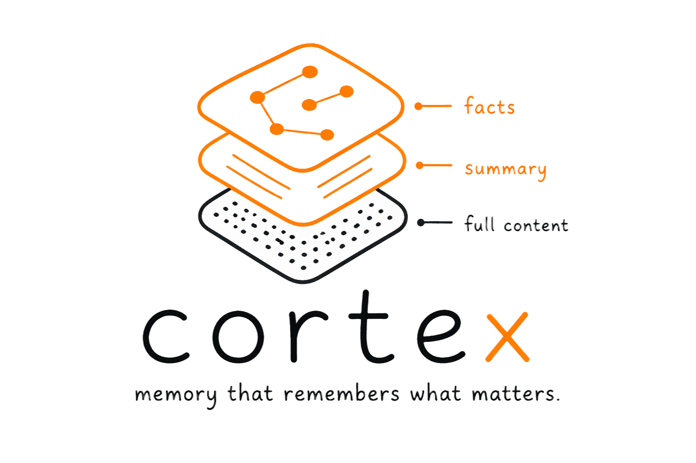

<h1 align="center">
  <br>
  <a href="https://github.com/rafaelaugustos/cortex-claude">
    
  </a>
  <br>
</h1>

<h4 align="center">Memory that remembers what matters. Built for <a href="https://claude.ai/claude-code" target="_blank">Claude Code</a>.</h4>

<p align="center">
  <a href="LICENSE">
    
  </a>
  <a href="pyproject.toml">
    
  </a>
  <a href="pyproject.toml">
    
  </a>
</p>

<p align="center">
  <a href="#quick-start">Quick Start</a> &bull;
  <a href="#how-it-works">How It Works</a> &bull;
  <a href="#tools">Tools</a> &bull;
  <a href="#configuration">Configuration</a> &bull;
  <a href="#benchmarks">Benchmarks</a> &bull;
  <a href="#development">Development</a>
</p>

<p align="center">
  Cortex gives Claude Code persistent memory through a local MCP server. Unlike solutions that dump everything into context, Cortex uses <strong>progressive recall</strong> &mdash; a 3-layer retrieval system that returns only what's relevant, using the minimum tokens needed.
</p>

---

## The Problem

Memory solutions for AI assistants today waste tokens. They inject entire memory banks into every prompt, regardless of relevance. Cortex takes a different approach:

**Save once:**
> "The auth service uses JWT tokens with 24-hour expiry. Refresh tokens are stored in httpOnly cookies."

**Ask later, get back only what matters:**

```
Layer 1: Facts (cheapest)
  auth service → use → jwt tokens
  auth service → use → hour expiry

Layer 2: Summary (~25% of original)

Layer 3: Full content (only if needed)
```

The system stops at the cheapest layer that answers the question. **66% fewer tokens** on average.

---

## Key Features

- **Progressive recall** &mdash; 3 layers (facts &rarr; summaries &rarr; full content), stops at the cheapest sufficient layer
- **Knowledge graph** &mdash; auto-extracts structured facts via spaCy NLP with multi-hop traversal
- **Smart extraction** &mdash; handles bullet lists, key:value pairs, comma lists, slash-separated tech, parentheticals, passive voice
- **Claude fallback** &mdash; optional Claude-assisted extraction when local NLP isn't enough
- **Entity normalization** &mdash; "postgres", "PostgreSQL", "pg" all resolve to the same entity
- **Graph traversal** &mdash; navigate entity connections across multiple hops (A &rarr; B &rarr; C)
- **Hybrid search** &mdash; vector similarity + FTS5 keyword search combined
- **Configurable scopes** &mdash; global, per-project, or custom memory boundaries
- **Deduplication** &mdash; detects and merges near-identical memories automatically
- **Decay system** &mdash; unused memories lose relevance over time, keeping results fresh
- **Multi-language** &mdash; EN, PT (auto-detected). ES, DE, FR with additional spaCy models
- **Local-first** &mdash; SQLite + local embeddings + local NLP. Zero API calls, zero network, zero cost
- **Fully configurable** &mdash; all thresholds, ratios, and behaviors via config.json

---

## Quick Start

### Install

```bash
pip install cortex-claude

# With Claude-assisted extraction (optional)
pip install cortex-claude[claude]
```

### Configure Claude Code

Add a `.mcp.json` to your project root (or `~/.claude.json` for global):

```json
{
  "mcpServers": {
    "cortex": {
      "type": "stdio",
      "command": "python",
      "args": ["-m", "cortex_claude"]
    }
  }
}
```

First run downloads the embedding model (~80MB) and spaCy model (~12MB) automatically.

### Use

Just talk to Claude naturally. Cortex works in the background:

```
"Remember that the API uses rate limiting at 500 req/min"
"What do you know about rate limiting?"
"What facts do you have about the API?"
"What's connected to the auth service?"
"Forget what I said about the old API key"
"Show me the memory status"
```

---

## Tools

Cortex exposes **7 MCP tools** to Claude Code:

| Tool | What it does | Token cost |
|------|-------------|------------|
| `cortex_save` | Store memory with auto fact extraction, summarization, and embedding | N/A |
| `cortex_recall` | Progressive retrieval: facts &rarr; summaries &rarr; full content | Controlled via `max_tokens` |
| `cortex_facts` | Direct knowledge graph query, returns structured triplets | ~5-15 tokens per fact |
| `cortex_traverse` | Navigate the knowledge graph across multiple hops | ~5-15 tokens per connection |
| `cortex_forget` | Delete memories by query or ID (dry-run by default) | N/A |
| `cortex_scopes` | Manage scopes: list, create, delete, link/unlink directories | N/A |
| `cortex_status` | Dashboard: memory count, fact count, storage size per scope | N/A |

### Recall Depth Modes

| Mode | Returns | When to use |
|------|---------|------------|
| `auto` | Starts cheap, escalates if needed | Default &mdash; best for most queries |
| `facts` | Only knowledge graph triplets | Quick lookups, minimal token use |
| `summaries` | Facts + compressed summaries | Medium detail needed |
| `full` | All layers including original text | Full context needed |

---

## How It Works

```
Save: content → embedding + fact extraction + summarization → SQLite

Recall (progressive):
  1. Facts layer     (~5-15 tokens/fact)   → sufficient? stop
  2. Summaries layer (~25% of original)    → sufficient? stop
  3. Full chunks     (original content)    → return
```

### Fact Extraction

Three methods combined for maximum coverage:

1. **spaCy NLP** &mdash; dependency parsing, NER, passive voice handling, conjunction expansion
2. **Pattern matching** &mdash; bullet lists (`- X for Y`), key:value, comma lists, slash-separated (`React/TypeScript`), parentheticals (`FastAPI (Python)`), with/for constructs
3. **Claude fallback** (opt-in) &mdash; when local extraction produces < 2 high-confidence facts, falls back to Claude Haiku. Off by default.

Entities are normalized and deduplicated: `"postgres"` &rarr; `"postgresql"`, `"js"` &rarr; `"javascript"`, `"k8s"` &rarr; `"kubernetes"`.

### Graph Traversal

Navigate entity connections across multiple hops:

```
auth → JWT → express-jwt → middleware
  ↓
  httpOnly cookies
```

Query `cortex_traverse("auth")` and discover everything connected.

### Decay

Memories that aren't accessed lose relevance over time:

```
score = e^(-lambda * days) * (1 + log(access_count))
```

Recalculated on server startup. Frequently accessed memories get boosted. Stale ones fade.

### Hybrid Search

Combines **vector similarity** (semantic meaning) with **FTS5** (exact keyword match) for best recall. FTS5 synced automatically via SQLite triggers.

---

## Cortex vs Traditional Memory (claude-mem, etc.)

Most memory solutions for AI assistants follow the same pattern: capture observations, compress them, inject into every prompt. Cortex takes a fundamentally different approach.

| | Traditional (claude-mem) | Cortex |
|---|---|---|
| **Storage model** | Compressed text / summaries | Knowledge graph (structured triplets) + summaries + full text |
| **Retrieval** | Auto-inject into every session | On-demand via MCP tools (only when needed) |
| **Token cost** | ~500-2000 tokens injected always | ~50-100 tokens (facts layer), scales only if needed |
| **Understanding** | Linear summaries | Structured facts with entity relationships |
| **Search** | Keyword / vector | Hybrid: semantic embedding + FTS5 keyword + graph traversal |
| **Extraction** | Captures tool call observations | NLP fact extraction (spaCy + patterns + optional Claude) |
| **Entity awareness** | None | "postgres" = "postgresql" = "pg" (normalized) |
| **Graph navigation** | None | Multi-hop traversal (A &rarr; B &rarr; C) |
| **Staleness** | No decay | Unused memories lose relevance over time |
| **Duplicates** | Can accumulate | Auto-merged (cosine similarity > 0.92) |
| **Dependencies** | Node.js, Bun, Chroma vector DB | Python + SQLite only (zero external services) |

**The fundamental difference:** traditional memory asks *"what happened?"* &mdash; Cortex asks *"what matters?"*

Traditional solutions observe and replay. Cortex understands, structures, and retrieves surgically. The result: fewer tokens, more relevant answers, and a knowledge graph that grows smarter over time.

---

## Benchmarks

With 10 stored memories (244 total tokens):

| Depth | Tokens returned | Reduction | Latency |
|-------|----------------|-----------|---------|
| `facts` | 82 | **66%** | ~10ms |
| `auto` | 82 | **66%** | ~10ms |
| `full` | 244 | 0% | ~12ms |

| Operation | Latency |
|-----------|---------|
| `cortex_facts` query | **0.1ms** |
| Graph traversal (2 hops) | **0.2ms** |
| Save (after model load) | **~30ms** |

Run benchmarks yourself:

```bash
uv run python scripts/benchmark.py
```

---

## Configuration

All behavior is customizable via `~/.cortex-claude/config.json`:

```json
{
  "recall": {
    "default_max_tokens": 200,
    "default_depth": "auto",
    "sufficiency": {
      "coverage_threshold": 0.7,
      "confidence_threshold": 0.6
    }
  },
  "embeddings": {
    "model": "all-MiniLM-L6-v2",
    "batch_size": 32
  },
  "facts": {
    "extraction_method": "local",
    "min_confidence": 0.5,
    "claude_fallback": false,
    "claude_confidence_threshold": 0.5
  },
  "decay": {
    "lambda": 0.05,
    "recalculate_interval_hours": 6,
    "min_score": 0.01
  },
  "deduplication": {
    "similarity_threshold": 0.92,
    "merge_strategy": "append"
  },
  "scopes": {
    "mappings": {
      "/path/to/project-a": "project:a",
      "/path/to/project-b": "project:b"
    },
    "default": "global",
    "search_order": "project_first"
  },
  "storage": {
    "max_db_size_mb": 500
  }
}
```

All fields are optional. Defaults are used for anything not specified.

See [`examples/`](examples/) for ready-to-use configuration files.

---

## Development

```bash
git clone https://github.com/rafaelaugustos/cortex-claude.git
cd cortex-claude
uv venv --python python3.13
uv sync --all-extras
uv run python -m spacy download en_core_web_sm
uv run pytest
```

```bash
# Run the demo
uv run python scripts/demo.py

# Run benchmarks
uv run python scripts/benchmark.py
```

See [CONTRIBUTING.md](CONTRIBUTING.md) for contribution guidelines.

## Architecture

See [ARCHITECTURE.md](ARCHITECTURE.md) for the full technical specification.

---

## License

MIT &mdash; see [LICENSE](LICENSE).

---

<p align="center">
  <strong>Built with Python</strong> &bull; <strong>Powered by Claude Code</strong> &bull; <strong>Made by <a href="https://github.com/rafaelaugustos">Rafael Augusto</a></strong>
</p>
